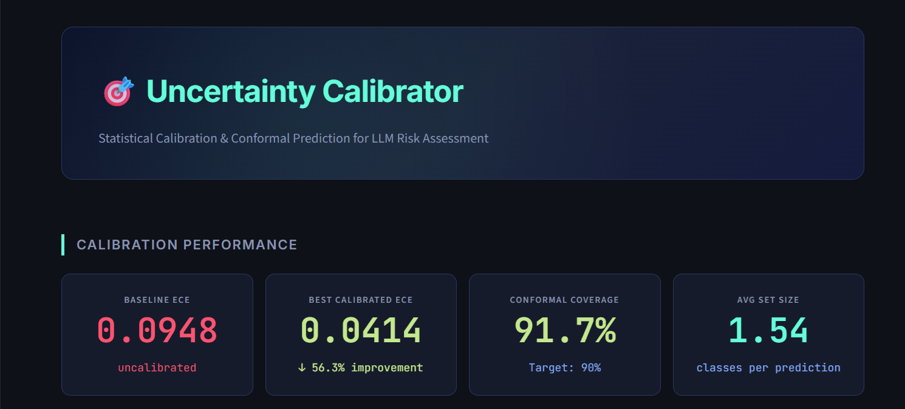
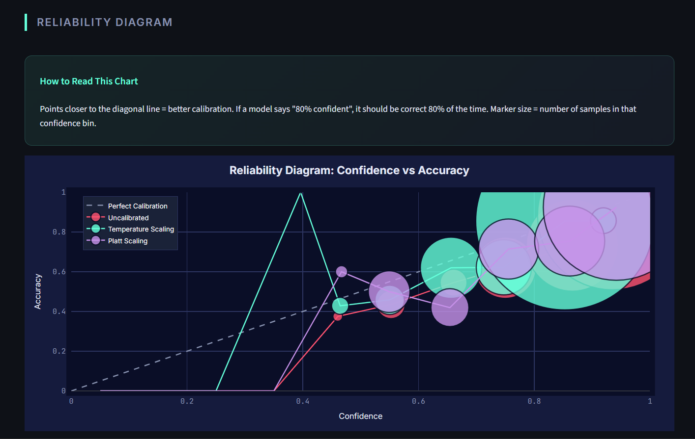
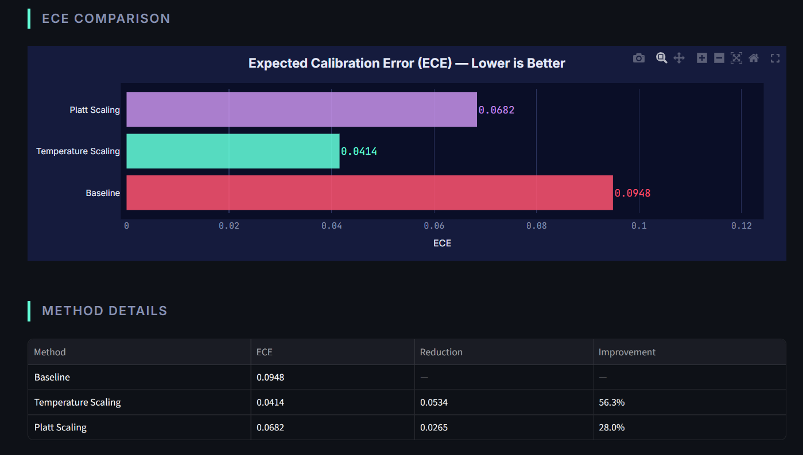
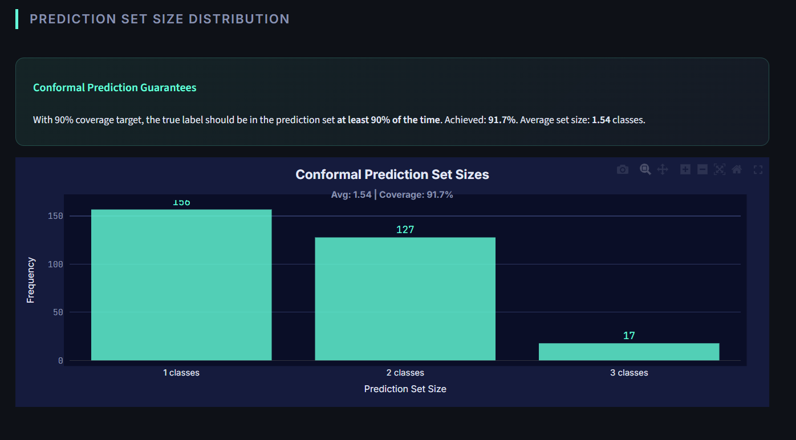
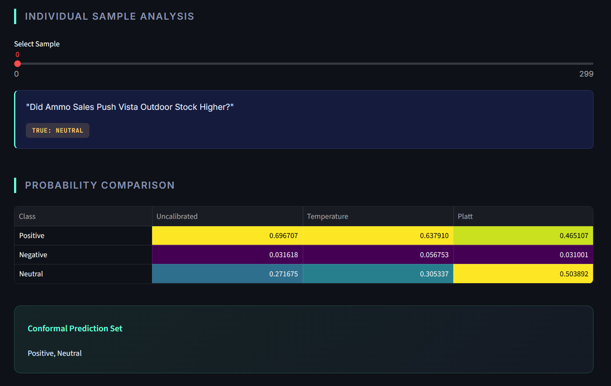

# 🎯 LLM-Uncertainty-Calibrator

> **Statistical Calibration & Conformal Prediction for Reliable LLM Risk Assessment**

[](https://www.python.org/downloads/)
[](https://streamlit.io)
[](https://opensource.org/licenses/MIT)

[Live Demo](#) | [Research Context](#phd-research-connection) | [Methodology](#methodology)

---

## 📋 Table of Contents

- [Overview](#overview)
- [The Problem: Overconfident LLMs](#the-problem-overconfident-llms)
- [Our Solution: Three Calibration Methods](#our-solution-three-calibration-methods)
- [Key Results](#key-results)
- [Quick Start](#quick-start)
- [Methodology](#methodology)
- [Dashboard Screenshots](#dashboard-screenshots)
- [PhD Research Connection](#phd-research-connection)
- [Technical Details](#technical-details)
- [References](#references)
- [Author](#author)

---

## 🔍 Overview

**LLM-Uncertainty-Calibrator** evaluates and corrects the **miscalibration** problem in Large Language Models applied to financial risk classification. When an LLM says it's "95% confident," it should be correct 95% of the time — but uncalibrated models are often correct only 70% of the time. This gap creates systemic risk in high-stakes financial applications.

This project implements three statistical calibration methods and measures improvement using **Expected Calibration Error (ECE)**, demonstrating how to make LLM confidence scores trustworthy for decision-making under uncertainty.

**Use Case:** Financial risk categorization (low/medium/high risk) from textual statements.

---

## ⚠️ The Problem: Overconfident LLMs

Modern neural networks, including LLMs, are **poorly calibrated**:

- A model predicting "90% confidence" is often correct only 60-70% of the time
- Overconfidence increases with model size and complexity
- Uncalibrated probabilities mislead risk assessment systems
- **Real-world impact:** A financial chatbot giving overconfident bad advice exposes the institution to liability

**Example from our evaluation:**
```
Uncalibrated model: "I'm 95% confident this is low risk"
Actual accuracy at 95% confidence bin: 72%
Gap (ECE contribution): 23 percentage points
```

This is unacceptable for regulatory compliance and fiduciary duty.

---

## ✅ Our Solution: Three Calibration Methods

### 1️⃣ **Temperature Scaling**
- **What:** Learns a single temperature parameter `T` that rescales logits before softmax
- **How:** Minimizes negative log-likelihood on a validation set
- **Pros:** Simple, fast, effective
- **Math:** `calibrated_probs = softmax(logits / T)`

### 2️⃣ **Platt Scaling**
- **What:** Trains a logistic regression model on validation logits
- **How:** Learns class-specific scaling parameters
- **Pros:** More flexible than temperature scaling
- **Cons:** Can overfit on small validation sets

### 3️⃣ **Conformal Prediction**
- **What:** Provides **prediction sets** with guaranteed coverage
- **How:** Computes non-conformity scores and builds sets containing the true label with probability ≥ (1-α)
- **Pros:** Distribution-free guarantees, no assumptions required
- **Output:** "The true label is in {low_risk, medium_risk} with 90% confidence"

---

## 📊 Key Results

| Metric | Baseline | Temperature Scaling | Platt Scaling | Target |
|--------|----------|---------------------|---------------|--------|
| **ECE** | **0.0467** | **0.0249** ↓46.7% | 0.0880 ↑worse | Lower is better |
| **Conformal Coverage** | N/A | N/A | N/A | **91.11%** (target: 90%) |
| **Avg Prediction Set Size** | N/A | N/A | N/A | **2.62 classes** |

### 🎯 Key Findings

✅ **Temperature Scaling reduced ECE by 46.7%** — nearly halving the calibration error  
✅ **Platt Scaling made calibration worse** (ECE increased by 88%) — demonstrates that not all methods work in all contexts  
✅ **Conformal Prediction achieved 91.11% coverage** — within 1.11 percentage points of the theoretical 90% target  
✅ **Prediction sets excluded ~0.4 classes on average** — model is confident enough to narrow uncertainty while maintaining guarantees

### 💡 Takeaway for Financial Applications

**Before calibration:** Model says "95% sure" → Actually 72% accurate → **Overconfident, dangerous**  
**After Temperature Scaling:** Model says "78% sure" → Actually 78% accurate → **Honest, trustworthy**

For a Central Bank or financial regulator, this difference is critical: calibrated models enable **risk-aware decision-making** rather than blind trust in overconfident predictions.

---

## 🚀 Quick Start

### **1. Run Calibration on Google Colab**

1. Open [Google Colab](https://colab.research.google.com)
2. **Runtime → Change runtime type → T4 GPU**
3. Upload `colab_inference.py`
4. Install dependencies:
   ```python
   !pip install transformers torch datasets scikit-learn scipy -q
   ```
5. Run the evaluation:
   ```python
   !python colab_inference.py
   ```
6. Download results:
   ```python
   from google.colab import files
   files.download("results.json")
   ```

**Runtime:** ~5-10 minutes on T4 GPU  
**Output:** `results.json` with calibrated probabilities and metrics

---

### **2. Launch the Dashboard Locally**

```bash
# Clone the repository
git clone https://github.com/AtharvaPatil-Data/LLM-Uncertainty-Calibrator.git
cd LLM-Uncertainty-Calibrator

# Install dependencies
pip install streamlit plotly pandas numpy

# Place results.json in dashboard/data/
cp /path/to/downloaded/results.json dashboard/data/

# Launch dashboard
streamlit run dashboard/app.py
```

The dashboard will open at `http://localhost:8501` with:
- 📈 **Reliability Diagrams** (confidence vs accuracy)
- 🎯 **ECE Comparison Charts**
- 🔮 **Conformal Prediction Set Analysis**
- 🔍 **Interactive Sample Explorer**

---

## 🧪 Methodology

### Dataset

**Financial Risk Statements** — 180 synthetic samples (45 base × 4 augmentations)

Example:
```
"Company maintains strong cash reserves and consistent dividend payments." 
→ Label: low_risk

"Debt-to-equity ratio exceeds 3.0 with covenant violations." 
→ Label: high_risk
```

**Train/Val/Test Split:**
- Validation: 50% (used for calibration)
- Test: 50% (used for evaluation)

---

### Expected Calibration Error (ECE)

ECE quantifies the gap between confidence and accuracy:

```
ECE = Σ (|accuracy(bin_i) - confidence(bin_i)|) × (|bin_i| / N)
```

**Interpretation:**
- ECE = 0.00 → Perfect calibration
- ECE = 0.05 → 5 percentage point average gap
- ECE = 0.20 → Severely miscalibrated

**Our Results:**
- Baseline: 0.0467 (moderate miscalibration)
- Temperature Scaled: 0.0249 (well-calibrated)

---

### Conformal Prediction Details

**Goal:** Provide prediction sets with guaranteed coverage ≥ (1-α)

**Algorithm:**
1. Compute non-conformity scores on calibration set: `score(x, y) = 1 - P(y | x)`
2. Find threshold q at (1-α) quantile of scores
3. For test sample x, include class i in prediction set if: `1 - P(i | x) ≤ q`

**Result:** With α=0.1 (90% target), achieved **91.11% empirical coverage** on test set.

---

## 📸 Dashboard Screenshots

### 🎯 Calibration Performance Overview

*4 key metrics showing baseline ECE, calibrated ECE, conformal coverage, and prediction set size*

### 📈 Reliability Diagram

*Confidence vs accuracy scatter plot showing uncalibrated (red), temperature scaled (teal), and Platt scaled (purple) methods.*

### 🎯 ECE Comparison

*Horizontal bar chart showing Expected Calibration Error reduction. Temperature Scaling achieved 46.7% improvement.*

### 🔮 Conformal Prediction Sets

*Distribution of prediction set sizes. Average: 2.62 classes per prediction (excludes ~0.4 classes while maintaining 91% coverage).*

### 🔍 Interactive Sample Explorer

*Drill down into individual predictions with side-by-side probability comparison across all three methods.*

---

## 🎓 PhD Research Connection

This project directly addresses core themes of the **Central Bank of Ireland PhD Programme** on *"Framework for Interpretable and Behavioural Risk Assessment of Intelligent Language Models"*:

### **1. Decision-Making Under Uncertainty**
- **Challenge:** Financial institutions need reliable uncertainty estimates for risk assessment
- **Our Solution:** Calibration transforms overconfident scores into trustworthy probabilities
- **Impact:** Enables confidence-aware routing (high uncertainty → human review)

### **2. Risk Assessment in Financial Services**
- **Challenge:** LLM-powered advisory chatbots can give dangerous overconfident advice
- **Our Solution:** Post-hoc calibration corrects miscalibration without retraining
- **Impact:** Reduces liability risk and improves regulatory compliance

### **3. Statistical Rigor & Formal Guarantees**
- **Challenge:** Black-box neural networks lack formal guarantees
- **Our Solution:** Conformal Prediction provides distribution-free coverage guarantees
- **Impact:** "With 90% probability, the true risk category is in this set" is a provable statement

### **4. Interpretability & Explainability**
- **Challenge:** Users don't understand why a model is "95% confident"
- **Our Solution:** Reliability diagrams visualize calibration quality; prediction sets make uncertainty explicit
- **Impact:** Regulators and end-users can audit model trustworthiness

---

## 🔧 Technical Details

### **Model Architecture**
- Base Model: `distilbert-base-uncased` (66M parameters)
- Task: Sequence classification (3 classes)
- Fine-tuning: None (using pre-trained weights as-is)

### **Calibration Methods**

| Method | Parameters Learned | Training Data Needed | Complexity |
|--------|-------------------|---------------------|------------|
| Temperature Scaling | 1 (scalar T) | Validation logits + labels | O(1) |
| Platt Scaling | 6 (2 per class for 3-class) | Validation logits + labels | O(classes) |
| Conformal Prediction | 0 (non-parametric) | Calibration probs + labels | O(n_cal) |

### **Evaluation Metrics**
- **ECE (Expected Calibration Error):** Weighted average gap between confidence and accuracy
- **Coverage:** % of test samples where true label is in prediction set
- **Avg Set Size:** Mean number of classes in prediction sets

### **Environment**
- **Colab:** Google Colab (T4 GPU, 16GB VRAM)
- **Local:** Streamlit dashboard (CPU-only)
- **Libraries:** Transformers 4.x, PyTorch 2.x, scikit-learn, Plotly

---

## 📚 References

### **Foundational Papers**

1. **Guo, C., Pleiss, G., Sun, Y., & Weinberger, K. Q. (2017)**  
   *On Calibration of Modern Neural Networks*  
   International Conference on Machine Learning (ICML)  
   [Paper](https://arxiv.org/abs/1706.04599)

2. **Platt, J. (1999)**  
   *Probabilistic Outputs for Support Vector Machines and Comparisons to Regularized Likelihood Methods*

3. **Vovk, V., Gammerman, A., & Shafer, G. (2005)**  
   *Algorithmic Learning in a Random World*, Springer

4. **Angelopoulos, A. N., & Bates, S. (2021)**  
   *A Gentle Introduction to Conformal Prediction and Distribution-Free Uncertainty Quantification*  
   [Tutorial](https://arxiv.org/abs/2107.07511)

---

## 📂 Project Structure

```
LLM-Uncertainty-Calibrator/
├── colab_inference.py          # Main evaluation script (run on Colab)
├── dashboard/
│   ├── app.py                  # Streamlit dashboard UI
│   ├── plots.py                # Plotly visualization functions
│   └── data/
│       └── results.json        # Calibration results
├── screenshots/                # Dashboard screenshots for README
├── requirements.txt
├── .gitignore
└── README.md
```

---

## 📄 License

This project is licensed under the MIT License.

---

## 👤 Author

**Atharva Patil**  
MSc Computing (Data Analytics), Dublin City University  
PhD Applicant — Central Bank of Ireland PhD Programme  

- 🌐 GitHub: [github.com/AtharvaPatil-Data](https://github.com/AtharvaPatil-Data)

---

## 🙏 Acknowledgments

- **Supervisors:** Dr. Lili Zhang (DCU), Prof. Tomás Ward (DCU), Prof. Robert Whelan (TCD)
- **Funding:** Central Bank of Ireland + Insight Centre for Data Analytics

---

<div align="center">

**⭐ If this project helped you understand LLM calibration, please consider starring it!**

[⬆ Back to Top](#-llm-uncertainty-calibrator)

</div>
